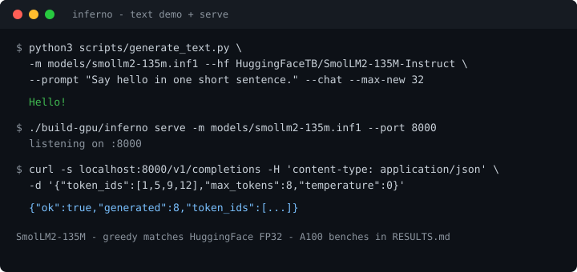

# Inferno

[](https://github.com/pratyushmathur1/inferno/actions/workflows/ci.yml)
[](LICENSE)

**From-scratch Llama serving in C++/CUDA:** continuous batching, paged KV, and GPU kernels — with greedy answers unchanged under concurrency.

Built to learn and measure the pieces inside vLLM-class systems, not to replace them. Runs real HuggingFace Llama-arch weights (SmolLM2-135M) end-to-end.



## Headline result (SmolLM2-135M, A100)

Chat prompt, ~27 new tokens. Full tables: [`RESULTS.md`](RESULTS.md).

| Engine | tok/s | TTFT ms | ITL ms | GPU mem MB |
|---|---:|---:|---:|---:|
| **Inferno FP32 + cuBLAS** | **279** | **8.5** | 3.4 | 1744 |
| PyTorch FP16 | 35 | 30.0 | 28.5 | 336 |
| vLLM 0.4.2 FP16 | 378 | 14.6 | **2.5** | 19543 |

> **Fairness:** Inferno is FP32 today; PyTorch/vLLM baselines above are FP16. Token identity is matched against HuggingFace FP32 greedy. Latency favors Inferno vs naive `generate`; vLLM still wins throughput — the honest place for a from-scratch engine. Memory is not apples-to-apples until an FP16 path lands.

## What it does

```
HTTP  POST /v1/completions
        │
   request queue          Engine::submit
        │
 continuous batching      chunked prefill, FCFS preemption
        │
   prefill / decode       one packed forward per scheduler step
        │
     paged KV             block table per sequence
        │
   CPU / GPU kernels      cuBLAS GEMM, fused add+RMSNorm, paged attn
```

- End-to-end serve loop with `POST /v1/completions`
- Paged KV + continuous batching; preemption keeps greedy tokens stable
- Real INF1 weights from HF; tokenizer-backed text demo
- Speculative decoding (Leviathan verify) with acceptance metrics
- Ablations behind flags: `--naive-gemm`, `--no-fuse`, `--no-graphs`
- Correctness suite: kernels, paged attn, batching, preemption, HTTP

Deeper design: [`ARCHITECTURE.md`](ARCHITECTURE.md).

## Quickstart

```bash
# CPU build + tests
make test
./build/inferno demo

# GPU build (sm_80 = A100; adjust as needed)
cmake -S . -B build-gpu -DCMAKE_BUILD_TYPE=Release \
  -DCMAKE_CXX_COMPILER=g++ -DINFERNO_CUDA=ON -DCMAKE_CUDA_ARCHITECTURES=80
cmake --build build-gpu -j
```

### Real model + text demo

```bash
pip install -r requirements.txt
python3 scripts/hf_to_inf1.py HuggingFaceTB/SmolLM2-135M-Instruct -o models/smollm2-135m.inf1

python3 scripts/generate_text.py \
  -m models/smollm2-135m.inf1 \
  --hf HuggingFaceTB/SmolLM2-135M-Instruct \
  --prompt "Say hello in one short sentence." --chat --max-new 64 \
  --inferno ./build-gpu/inferno
```

### Serve

```bash
./build-gpu/inferno serve -m models/smollm2-135m.inf1 --port 8000
curl -s http://127.0.0.1:8000/v1/completions \
  -H 'content-type: application/json' \
  -d '{"token_ids":[1,5,9,12],"max_tokens":16,"temperature":0}'
```

### Reproduce benches

```bash
./scripts/reproduce.sh              # CPU tests + GPU build
./scripts/reproduce.sh --full       # + SmolLM2 convert, text demo, latency bench
./scripts/reproduce.sh --cpu-only   # CI-equivalent local run
```

GPU flags: `--cuda` / `--cpu` / `--no-graphs` / `--naive-gemm` / `--no-fuse` / `--profile-forward`.

## More

| Doc / path | Contents |
|---|---|
| [`RESULTS.md`](RESULTS.md) | A100 ablations: cuBLAS, fusion, speculation, batch scaling |
| [`ARCHITECTURE.md`](ARCHITECTURE.md) | Scheduler, paged KV, GPU dataflow |
| `results/` | Raw JSON + CUDA-event profiles |
| `scripts/serious_bench.py` | TTFT / ITL / tok/s / memory vs PyTorch |

```
include/inferno/             public headers
src/                         scheduler, model, HTTP, CPU kernels, speculative
kernels/cuda_kernels.cu      CUDA operators, fusion, graphs, cuBLAS
scripts/                     HF convert, demos, benches, reproduce.sh
tests/test_inferno.cpp       correctness suite
```

## Scope / limitations

- Single GPU (or CPU). No multi-node serving.
- Default weights path is float32 INF1; FP16 serving is future work.
- Speculative decoding is correctness-complete; shallow drafts do not yet beat target-only latency (needs a trained drafter).
- INT8 / FP8 / tensor-parallel helpers are CPU unit-tested, not the production serve path.
